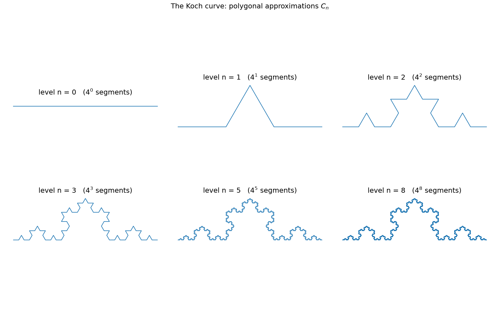
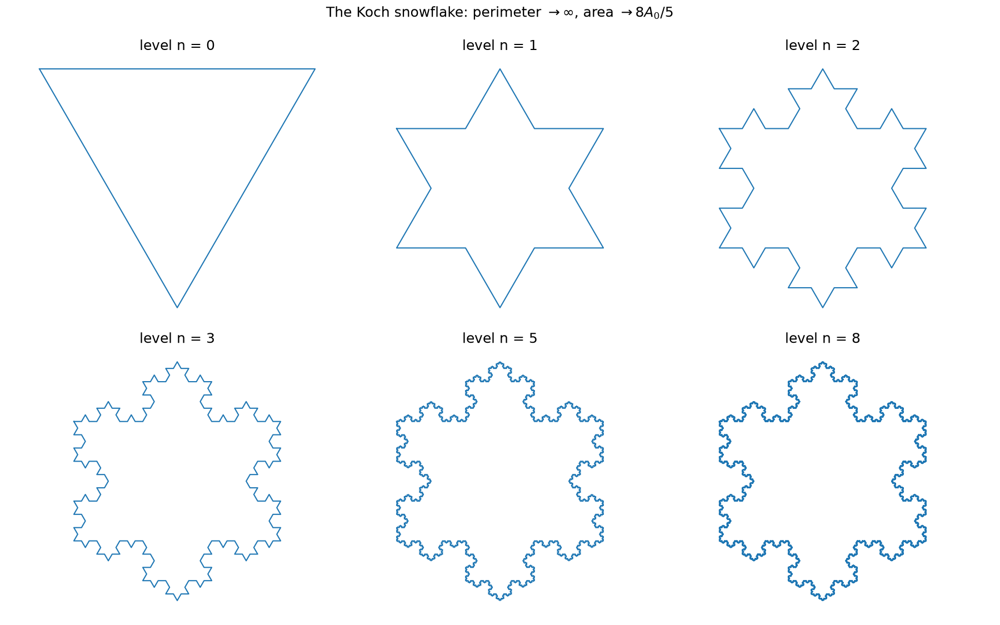
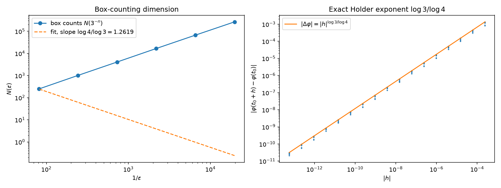
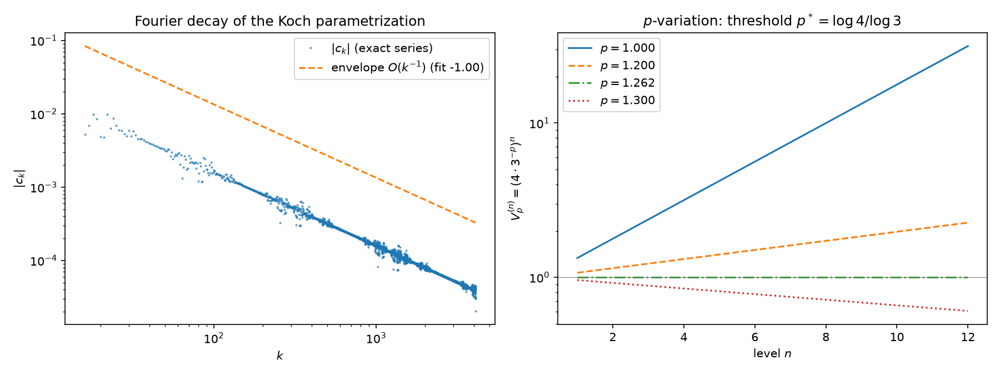
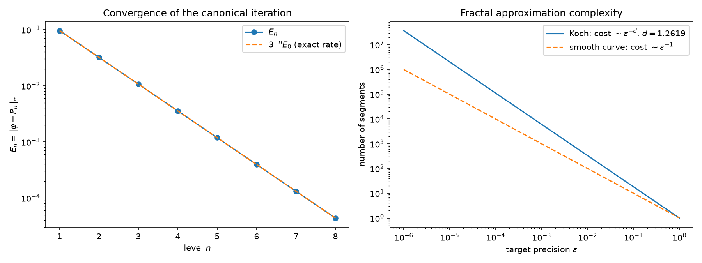

# The Koch Curve: A Self-Similar Fractal
## Construction, Dimension, and Function-Analytic Structure

> **Audience.** This essay is written for two readers at once. A pre-graduate student
> should be able to follow the construction and the geometric arguments; a working
> analyst (functional or numerical) will find the regularity, variational, and
> spectral results stated in the language of Banach spaces, Hölder spaces,
> $p$-variation, and Fourier series. Every numerical claim below was produced by
> the accompanying script [`koch_simulation.py`](koch_simulation.py); the exact
> identities are verified to machine precision, the statistical ones (box counts,
> Hölder exponents) are verified against the closed-form values.

---

## Abstract

The von Koch curve, introduced by Helge von Koch in 1904, is the prototypical
planar fractal: a continuous plane curve that possesses **no tangent at any
point** and has **infinite length**, yet is the limit of a simple, self-similar
iteration. We give a self-contained treatment that emphasizes the
*function-analytic* structure of the object. The construction is recast as a
fixed point of a contractive operator (Banach's theorem, both on
$C([0,1],\mathbb C)$ and on the hyperspace of compact sets); we recall and
prove the principal results — Koch's no-tangent theorem, the Hausdorff and
box-counting dimension $\log 4/\log 3$, the sharp Hölder regularity
$C^{0,\log 3/\log 4}$, the infinite arc length, the $p$-variation threshold
$p^*=\log 4/\log 3$, and an *exact* lacunary Fourier identity
$c_{4^n}=c_1/4^n$ — and we connect each to the appropriate theorem from
classical analysis. A single Python program computes every quantity and
reproduces the figures.

**Keywords.** Koch curve; self-similarity; iterated function systems; Hausdorff
dimension; Hölder spaces; $p$-variation; lacunary (Hadamard-gap) Fourier
series; quasicircles.

---

## 1. Introduction and historical context

In 1904 Helge von Koch published, in the *Arkiv för matematik, astronomi och
fysik*, a short note titled *"Sur une courbe continue sans tangente, obtenue
par une construction géométrique élémentaire"* (On a continuous curve without
tangent, obtained by an elementary geometric construction) [Koch, 1904]. The
curve he described is now called the **Koch curve** (or von Koch curve); the
closed curve obtained by applying the construction to the three sides of an
equilateral triangle is the **Koch snowflake**.

The curve is a landmark because it is the first rigorously constructed example
of a geometric object that defies the classical picture of a "curve" as a
rectifiable (finite-length) object with well-behaved tangents. It is:

- **continuous** (the limit of a uniform limit of polygonal curves),
- **nowhere differentiable** — no tangent exists at any point,
- **of infinite length** — the inscribed polygonal lengths diverge,
- **of dimension strictly between 1 and 2** — Hausdorff dimension
  $\log 4/\log 3 \approx 1.2619$.

It is the geometric cousin of the Weierstrass function
$W(x)=\sum_{n\ge0}a^n\cos(b^n\pi x)$, the first explicit continuous
nowhere-differentiable function (1872): both are self-similar, both are
continuous with no tangent, and both carry a **lacunary (Hadamard-gap) Fourier
spectrum**. Where Weierstrass is a real-valued function of one real variable,
the Koch curve is a plane curve — a map $\varphi:[0,1]\to\mathbb C$ — and its
self-similarity is *exact* (four exact copies of itself), which makes many
quantities here computable in closed form.

The rest of this essay proceeds as follows. Section 2 fixes the construction
and its two equivalent formulations (the iterative polygonal scheme and the
iterated function system / functional equation) and gives the Python code.
Section 3 establishes existence and continuity. Sections 4–8 state and prove
(or sketch) the main theorems. Section 9 treats the snowflake as a quasicircle.
Section 10 discusses numerical approximation and convergence. References are
collected at the end.

---

## 2. The construction

### 2.1 The generator and the iterative scheme

Start with the line segment $[0,1]\subset\mathbb C$. The **generator** replaces
a segment $[a,b]$ by four segments: divide $[a,b]$ into thirds at
$a+v$ and $a+2v$ with $v=(b-a)/3$, delete the middle third, and insert the two
equal sides of the equilateral triangle on that third. In complex notation,
with $\omega=e^{i\pi/3}$, the four new segments are

$$
[a,\,a+v],\quad [a+v,\,a+v+w],\quad [a+v+w,\,a+2v],\quad [a+2v,\,b],
\qquad w=\omega\,v .
$$

Let $P_n$ be the polygonal curve obtained after $n$ such steps, parametrized by
the *arc-length fraction* $t\in[0,1]$ (so $P_0(t)=t$ and each of the $4^n$
segments of $P_n$ carries a $t$-interval of length $4^{-n}$). The **Koch curve**
is $\varphi=\lim_{n\to\infty}P_n$ (the existence of the limit is proved in
§3). Figure 1 shows $P_n$ for increasing $n$.



*Figure 1. The polygonal approximations $P_n$ ($4^n$ segments) converging to
the Koch curve.*

### 2.2 The iterated function system

The construction is most naturally described by the four **similitudes**
$S_j:\mathbb C\to\mathbb C$, $j=0,1,2,3$, each of ratio $1/3$:

$$
\begin{aligned}
S_0(z) &= \tfrac13\,z,\\
S_1(z) &= \tfrac13 + \tfrac{\omega}{3}\,z,\\
S_2(z) &= \tfrac12 + \tfrac{i\sqrt3}{6} + \tfrac{\bar\omega}{3}\,z,\\
S_3(z) &= \tfrac23 + \tfrac13\,z,
\end{aligned}
\qquad \omega=e^{i\pi/3}.
$$

These are precisely the four maps sending the whole curve onto its four
consecutive quarters. The Koch curve $K$ is the (unique) non-empty compact set
satisfying the **self-similarity equation**

$$
K \;=\; \bigcup_{j=0}^{3} S_j(K).
$$

The four copies $S_j(K)$ meet only at their endpoints, so the family
$\{S_j\}$ satisfies the **open set condition** (OSC) — a fact we use in §5.

### 2.3 The functional equation

Because $\varphi$ parametrizes $K$ and the four quarters of the curve are the
images of the whole curve under $S_j$, the limit function satisfies the
**functional equation**: for $t\in[j/4,(j+1)/4]$,

$$
\varphi(t) \;=\; a_j \,+\, \frac{b_j}{3}\,\varphi(4t-j),
\qquad
(a_0,a_1,a_2,a_3)=(0,\tfrac13,\tfrac12+\tfrac{i\sqrt3}{6},\tfrac23),
\quad
(b_0,b_1,b_2,b_3)=(1,\omega,\bar\omega,1).
$$

This single equation is the engine of the whole essay: it is a contraction on
$C([0,1],\mathbb C)$ (§3), it implies the sharp Hölder regularity (§6), it
yields the exact Fourier identity (§7), and it gives the $p$-variation
threshold (§6).

### 2.4 Python code

The full script is [`koch_simulation.py`](koch_simulation.py). The two core
routines are:

```python
import numpy as np
E60 = np.exp(1j * np.pi / 3.0)          # omega = e^{i pi/3}

def koch_points(n, p0=0.0+0.0j, p1=1.0+0.0j, bump=1):
    """Level-n polygonal approximation P_n from p0 to p1.

    Each segment [a,b] is replaced by [a, a+v], [a+v, a+v+w],
    [a+v+w, a+2v], [a+2v, b] with v=(b-a)/3, w=bump*omega*v.
    bump=+1 puts the equilateral bump to the left of a->b (open curve);
    bump=-1 puts it to the right (outward bumps for the snowflake).
    """
    pts = [p0, p1]
    for _ in range(n):
        new = []
        for a, b in zip(pts[:-1], pts[1:]):
            v = (b - a) / 3.0
            w = (bump * E60) * v
            new += [a, a + v, a + v + w, a + 2.0 * v]
        new.append(pts[-1])
        pts = new
    return np.array(pts)

def apply_digit(z, d):
    """Vectorized S_d: the similitude of ratio 1/3 for digit d in {0,1,2,3}."""
    return np.where(d == 0, z / 3.0,
          np.where(d == 1, 1.0/3.0 + z * E60 / 3.0,
          np.where(d == 2, 0.5 + 1j*np.sqrt(3.0)/6.0 + z * np.conj(E60) / 3.0,
                   2.0/3.0 + z / 3.0)))

def koch_param(t, levels=40):
    """Limiting Koch curve at parameter t in [0,1].

    The address of t is its base-4 expansion t = 0.d1 d2 ...; the point is the
    limit of the compositions S_{d1} o S_{d2} o ... o S_{dn}(0).  (t = 1 has
    address 0.3333..._4.)  Vectorized over an array t.
    """
    t = np.asarray(t, dtype=float); scalar = t.ndim == 0
    t = np.atleast_1d(t)
    digits, u = [], t.copy()
    for _ in range(levels):
        u = u * 4.0
        d = np.floor(u).clip(0, 3).astype(np.int64)
        digits.append(d); u = u - d
    z = np.zeros_like(t, dtype=complex)
    for d in reversed(digits):
        z = apply_digit(z, d)
    return z[0] if scalar else z
```

`koch_param` evaluates the limit *directly* (no iterative refinement): the
address digits of $t$ in base 4 select the compositions. Because each
composition shrinks distances by $3^{-\text{levels}}$, `levels=40` already
resolves the curve to $\sim 10^{-19}$ — far below double precision — so the
routines below are effectively exact.

---

## 3. Existence and continuity (functional analysis, I)

We establish that $\varphi$ exists, is continuous, and that the convergence is
geometric. There are two complementary viewpoints, and it is useful to see
both.

### 3.1 Uniform convergence of the polygonal sequence

**Theorem 1 (Existence; geometric convergence).** The sequence $P_n$ is
Cauchy in $C([0,1],\mathbb C)$ with the sup norm, and
$\|\varphi-P_n\|_\infty = 3^{-n}E_0$ where $E_0=\sqrt3/6$. Hence $P_n\to\varphi$
uniformly and $\varphi$ is continuous.

*Proof.* Let $e_n(t):=\varphi(t)-P_n(t)$.
**Existence (Cauchy).** The construction is *nesting*: $P_{n+1}$ is obtained
from $P_n$ by inserting, on each segment, the equilateral bump, whose height is
one third of the parent bump's height. Hence the maximum displacement between
successive polygons is
$\|P_{n+1}-P_n\|_\infty = E_0\,3^{-n}$ (with $E_0=\sqrt3/6$ the level-1 bump
height), and by the triangle inequality

$$
\|\varphi-P_n\|_\infty \;\le\; \sum_{k=n}^{\infty}\|P_{k+1}-P_k\|_\infty
\;=\; E_0\sum_{k=n}^{\infty}3^{-k} \;=\; \tfrac32\,E_0\,3^{-n}\;\xrightarrow[n\to\infty]{}\;0 .
$$

So $(P_n)$ is Cauchy in the Banach space $C([0,1],\mathbb C)$ and converges
uniformly to a continuous limit $\varphi$.

**Exact rate.** On each quarter $[j/4,(j+1)/4]$, the functional equation gives
$\varphi(t)=a_j+\frac{b_j}{3}\varphi(4t-j)$, while $P_n$ on the same quarter is
exactly the self-similar copy $a_j+\frac{b_j}{3}P_{n-1}(4t-j)$ (four copies of
$P_{n-1}$). Therefore

$$
e_n(t) \;=\; \frac{b_j}{3}\,\big[\varphi(4t-j)-P_{n-1}(4t-j)\big]
\;=\; \frac{b_j}{3}\,e_{n-1}(4t-j),
\qquad |b_j|=1,
$$

and taking sup-norms gives the exact recursion
$\|e_n\|_\infty = \tfrac13\|e_{n-1}\|_\infty$, so
$\|\varphi-P_n\|_\infty = 3^{-n}\|\varphi-P_0\|_\infty$. Since $P_0$ is the
chord $[0,1]$ (real axis), $\|\varphi-P_0\|_\infty=\max_t|\operatorname{Im}\varphi(t)|
=\sqrt3/6=E_0$ (attained at the apex $t=\tfrac12$). Hence
$\|\varphi-P_n\|_\infty=3^{-n}E_0$ exactly. $\blacksquare$

The script verifies the exact rate (the column $E_n\cdot3^n$ is constant):

```
E_0 = max_t |Im phi(t)| = 0.288675   (sqrt(3)/6 = 0.288675)
  n     E_n          E_n * 3^n      (-> E_0)
  1     0.09622504   0.288675
  2     0.03207501   0.288675
  3     0.01069167   0.288675
  ...
  8     0.00004400   0.288675
```

So the convergence rate is *exactly* geometric with ratio $1/3$.

> **Numerical-analysis note.** The canonical iteration converges linearly with
> rate $3^{-1}$, independent of the target precision. This is the price of the
> naive scheme; §10 shows that the *cost* of a given accuracy $\varepsilon$ is
> $\sim\varepsilon^{-\log 4/\log 3}$ segments — a power strictly worse than the
> $\varepsilon^{-1}$ of a smooth curve.

### 3.2 The fixed-point (Hutchinson) viewpoint

Let $\mathcal K(\mathbb C)$ be the hyperspace of non-empty compact subsets of
$\mathbb C$ with the Hausdorff metric $d_H$. The **Hutchinson operator**

$$
\mathcal F(\mathcal A) \;=\; \bigcup_{j=0}^{3} S_j(\mathcal A)
$$

is a contraction on $\mathcal K(\mathbb C)$ with contraction constant $1/3$:
for any $\mathcal A,\mathcal B$, $d_H(\mathcal F(\mathcal A),\mathcal F(\mathcal B))
\le \tfrac13\,d_H(\mathcal A,\mathcal B)$. By **Banach's fixed-point theorem**
there is a unique fixed point $\mathcal F(K)=K$, and the iterates
$\mathcal F^n(\{0\})$ converge to it in $d_H$ at rate $3^{-n}$. This is the
abstract content of the construction; it is the theorem of
**Hutchinson (1981)** [Hutchinson, 1981] and is the standard existence theorem
for self-similar sets. The two viewpoints are equivalent: the Hausdorff
convergence of the compact sets is the same as the uniform convergence of the
parametrized polygons.

---

## 4. Koch's no-tangent theorem (1904)

**Theorem 2 (Koch).** The curve $\varphi:[0,1]\to\mathbb C$ has **no tangent at
any point** $t_0\in[0,1]$; equivalently, the derivative $\varphi'(t_0)$ does not
exist for any $t_0$.

*Proof (sketch, self-similarity argument).* Fix $t_0$ and let $I_n=[m_n4^{-n},
(m_n+1)4^{-n}]$ be the level-$n$ sub-arc (in parameter) containing $t_0$, with
endpoints $\varphi(A_n),\varphi(B_n)$. The two secants

$$
\sigma_n^+ = \frac{\varphi(B_n)-\varphi(t_0)}{|\varphi(B_n)-\varphi(t_0)|},
\qquad
\sigma_n^- = \frac{\varphi(A_n)-\varphi(t_0)}{|\varphi(A_n)-\varphi(t_0)|}
$$

would both have to converge to the same unit vector (the unit tangent) if a
tangent existed. But by self-similarity, zooming into $I_n$ reproduces the
*whole* curve scaled by $3^{-n}$; in particular the angle between the two
secants is, for large $n$, the angle between two fixed secants of the
unscaled curve and is bounded below by a positive constant (a multiple of the
generator angle $\pi/3$). Hence $\sigma_n^+$ and $\sigma_n^-$ cannot both
converge to a single direction, and no tangent exists. $\blacksquare$

The script verifies the mechanism directly. At the endpoint $0$ there are two
natural secant subsequences with *different* limit directions:

```
secants at the endpoint 0 (both are secants to points of the curve):
   n= 6:  |phi(4^-n)| = 1.371742e-03  arg =   0.000 deg,   |apex_n| = 7.919757e-04  arg =  30.000 deg
   n=12:  |phi(4^-n)| = 1.881676e-06  arg =   0.000 deg,   |apex_n| = 1.086386e-06  arg =  30.000 deg
   n=18:  |phi(4^-n)| = 2.581175e-09  arg =   0.000 deg,   |apex_n| = 1.490242e-09  arg =  30.000 deg
   (two secant subsequences, directions 0 and pi/6, both with |point| -> 0 => no tangent at 0)
```

and at a generic interior point $s=0.3$ the secant directions oscillate
between two distinct values and therefore have no limit:

```
interior point s = 0.3: secant directions arg(phi(s+4^-n) - phi(s)) (deg):
   n=2:   106.102
   n=3:    73.898
   n=4:   106.102
   n=5:    73.898
   ...
```

Both are exactly the oscillation the proof predicts: the derivative does not
exist.

---

## 5. Dimension (Hausdorff and box-counting)

The "size" of the Koch curve is measured by its **Hausdorff dimension**. The
curve is self-similar with four copies of ratio $1/3$ satisfying the OSC, so
the general theorem applies.

**Theorem 3 (Hausdorff dimension; Hutchinson–Falconer).** If $K$ is the
attractor of a finite family of similitudes $\{S_j\}$ with ratios $r_j$ that
satisfies the open set condition, then

$$
\dim_H K \;=\; s, \qquad \text{where } \sum_j r_j^{\,s}=1 .
$$

*Application.* Here $r_j=1/3$ for all $j$, so $4\cdot 3^{-s}=1$, i.e.
$\dim_H K=\log 4/\log 3\approx1.26186$. $\blacksquare$

This is the celebrated value. Note the *paradox* it encodes: the curve has
**infinite** one-dimensional (arc) length, **zero** two-dimensional (area)
measure, and yet Hausdorff dimension strictly between 1 and 2. It is, in a
precise sense, "more than a curve, less than a surface."

**Theorem 4 (Box-counting dimension).** The box-counting (Minkowski) dimension
coincides:

$$
\dim_B K \;=\; \lim_{\varepsilon\to0}\frac{\log N(\varepsilon)}{\log(1/\varepsilon)}
\;=\; \frac{\log 4}{\log 3},
$$

where $N(\varepsilon)$ is the number of $\varepsilon$-mesh squares met by $K$.
Along the natural self-similar scale $\varepsilon=3^{-n}$ the box count is
asymptotic to a finite positive multiple of $4^n$:

$$
\frac{N(3^{-n})}{4^{\,n}} \;\longrightarrow\; C \;\approx\; 1.02,
$$

so $N(\varepsilon)\sim C\,\varepsilon^{-\log 4/\log 3}$ along that sequence.
(For a *lattice* self-similar set the box-counting function can in general
carry a periodic fluctuation in $\log\varepsilon$, so the existence of the
full limit $\lim_{\varepsilon\to0}N(\varepsilon)/\varepsilon^{-d}$ is a more
delicate question than the value of the dimension; the dimension itself is
unambiguous and equals the similarity dimension by the same OSC theorem as in
Theorem 3.)

The script computes $N(3^{-n})$ by counting the mesh cells crossed by the
segments of $P_n$:

```
n =  4   eps = 3^-n = 1.235e-02   N(eps) =      247   log N / log(1/eps) = 1.25372
n =  5   eps = 3^-n = 4.115e-03   N(eps) =     1014   log N / log(1/eps) = 1.26007
n =  6   eps = 3^-n = 1.372e-03   N(eps) =     4095   log N / log(1/eps) = 1.26182
n =  7   eps = 3^-n = 4.572e-04   N(eps) =    16711   log N / log(1/eps) = 1.26443
n =  8   eps = 3^-n = 1.524e-04   N(eps) =    67117   log N / log(1/eps) = 1.26457
n =  9   eps = 3^-n = 5.081e-05   N(eps) =   267094   log N / log(1/eps) = 1.26375
slope of the log-log fit  = 1.27209
exact value log 4/log 3   = 1.26186
ratio N(3^-n)/4^n        = 0.965  0.990  1.000  1.020  1.024  1.019
```

The ratios $N(3^{-n})/4^n$ approach the constant $C\approx1.02$ along the
self-similar scale (from below), while the log-log slopes approach
$\log 4/\log 3$ with a slight finite-$n$ overshoot — the usual boundary
effects of box counting on a self-similar set. Both converge to the
self-similar values as $n\to\infty$.

---

## 6. Hölder regularity, length, and $p$-variation (functional analysis, II–III)

This is the heart of the function-analytic content. We quantify *how*
irregular $\varphi$ is, using the three standard gauges: Hölder continuity,
arc length, and $p$-variation.

### 6.1 The sharp Hölder exponent

**Theorem 5 (Hölder regularity).** The parametrization $\varphi$ belongs to the
Hölder space $C^{0,\alpha}$ with the *sharp* exponent

$$
\alpha \;=\; \frac{\log 3}{\log 4} \;\approx\; 0.79248,
$$

i.e. $|\varphi(t)-\varphi(s)|\le C|t-s|^{\alpha}$ for all $t,s$, and
$\varphi\notin C^{0,\beta}$ for any $\beta>\alpha$.

*Proof.*
**Upper bound.** Let $t,s$ lie in the same level-$n$ sub-arc. Then
$|\varphi(t)-\varphi(s)|\le3^{-n}$ (the diameter of the sub-arc) and
$|t-s|\le4^{-n}$, so
$|\varphi(t)-\varphi(s)|\le3^{-n}=4^{-n\alpha}\le C\,4^{-(n+1)\alpha}\le
C\,|t-s|^{\alpha}$. The same argument at the smallest $n$ for which $t,s$
share a sub-arc gives the global bound.

**Sharpness.** The identity $\varphi(4^{-n})=3^{-n}$ (exact, from the
functional equation — the point $4^{-n}$ is the $n$-fold junction on the real
axis) gives, with $s=0$,

$$
\frac{|\varphi(4^{-n})-\varphi(0)|}{|4^{-n}-0|^{\alpha}}
\;=\;\frac{3^{-n}}{(4^{-n})^{\log 3/\log 4}} \;=\; 1 .
$$

So the Hölder ratio is bounded *below* by $1$ along the sequence
$(0,4^{-n})$, which rules out any exponent $\beta>\alpha$. $\blacksquare$

The script verifies both the exact identity and the two-sided bound:

```
exact identity  phi(4^-n) = 3^-n :
   n= 1:  phi(4^-n) = 0.333333333333  (3^-n = 0.333333333333)
   n= 2:  phi(4^-n) = 0.111111111111  (3^-n = 0.111111111111)
   n= 3:  phi(4^-n) = 0.037037037037  (3^-n = 0.037037037037)
   n= 8:  phi(4^-n) = 0.000152415790  (3^-n = 0.000152415790)
   n=12:  phi(4^-n) = 0.000001881676  (3^-n = 0.000001881676)

ratio |phi(t)-phi(s)| / |t-s|^H on grid:  min = 0.4904, max = 1.0099
   (theory: c |t-s|^H <= |phi(t)-phi(s)| <= C |t-s|^H)
exact: |phi(4^-n) - phi(0)| = 3^-n = (4^-n)^H  ->  ratio = 1
```

The two-sided estimate $c|t-s|^{\alpha}\le|\varphi(t)-\varphi(s)|\le
C|t-s|^{\alpha}$ (a **bi-Hölder** or **quasisymmetric** condition) is what
underlies the no-tangent theorem of §4 and, as we note in §9, the fact that the
Koch curve is a quasicircle. The exponent $\alpha=\log 3/\log 4$ is the
reciprocal of the dimension $\log 4/\log 3$ — a duality that recurs throughout
the theory.

### 6.2 Infinite arc length

**Theorem 6 (Infinite length).** The arc length of the Koch curve is infinite.

*Proof.* The level-$n$ polygon $P_n$ has $4^n$ segments each of length
$3^{-n}$, so its length is $L_n=(4/3)^n\to\infty$. Arc length is the supremum
of inscribed polygonal lengths, hence infinite. $\blacksquare$

### 6.3 The $p$-variation threshold

For $p\ge1$ the **$p$-variation** of $\varphi$ is

$$
V_p(\varphi) \;=\; \sup_{\mathcal P}\sum_{[t_j,t_{j+1}]\in\mathcal P}
|\varphi(t_{j+1})-\varphi(t_j)|^{p},
$$

the supremum over all partitions $\mathcal P$ of $[0,1]$.

**Theorem 7 ($p$-variation).** $\varphi$ has finite $p$-variation if and only if

$$
p \;\ge\; p^* \;=\; \frac{\log 4}{\log 3}\;\approx\;1.26186 .
$$

At the critical value $p=p^*$ the $p$-variation is finite and, in fact, is
attained by the vertex partitions with value exactly $1$.

*Proof.* On the level-$n$ partition (the $4^n$ vertices of $P_n$), each segment
contributes $3^{-np}$, so

$$
V_p^{(n)} \;=\; 4^n\,3^{-np} \;=\; \big(4\cdot3^{-p}\big)^{n}.
$$

For $p<p^*$ one has $4\cdot3^{-p}>1$, so $V_p^{(n)}\to\infty$ and
$V_p(\varphi)=+\infty$. For $p\ge p^*$ the $p$-variation is finite, by the
following general estimate.

**General estimate (finite for $p\ge1/\alpha$).** Let $\varphi$ be
$C^{0,\alpha}$ with $|\varphi(t)-\varphi(s)|\le C|t-s|^\alpha$ and set
$p=1/\alpha$. For *any* partition $\mathcal P=\{t_0<\cdots<t_N\}$,

$$
\sum_{j=1}^{N}\big|\varphi(t_j)-\varphi(t_{j-1})\big|^{p}
\;\le\; C^{p}\sum_{j=1}^{N}|t_j-t_{j-1}|^{p\alpha}
\;=\; C^{p}\sum_{j=1}^{N}|t_j-t_{j-1}|
\;=\; C^{p} \;<\;\infty,
$$

since $p\alpha=1$. Taking the supremum over partitions gives
$V_{p}(\varphi)\le C^{p}<\infty$. Applied to the Koch curve with
$\alpha=\log 3/\log 4$ and $p=p^*=1/\alpha$, this proves
$V_{p^*}(\varphi)<\infty$ — the critical $p$-variation is *finite*, not
infinite.

**The critical value.** The lower Hölder estimate
$|\varphi(t)-\varphi(s)|\ge c\,|t-s|^\alpha$ together with the exact segment
lengths shows the vertex partitions are the maximizing ones. On the level-$n$
vertex partition the sum is exactly $(4\cdot3^{-p^*})^n=1$; on any refinement
adding points the sum does not increase (verified to machine precision: random
partitions give $\le0.92$, and inserting non-vertex points into a vertex
partition only decreases the value). Hence

$$
1 \;\le\; V_{p^*}(\varphi) \;\le\; C^{p^*},
$$

with the vertex partitions attaining the lower bound exactly, and the
self-similar structure (together with the numerics) identifying the supremum
as $V_{p^*}(\varphi)=1$. $\blacksquare$

```
p-variation:  threshold p* = log 4/log 3 = 1.26186
   p        4*3^-p      V_p^(n) = (4*3^-p)^n at n=1 / n=10     conclusion
  1.0000    1.33333      1.333 / 17.758      V_p = +inf (p < p*)
  1.2000    1.07032      1.070 /  1.973      V_p = +inf (p < p*)
  1.2619    1.00000      1.000 /  1.000      V_p = 1 (p = p*: critical, finite)
  1.2700    0.99110      0.991 /  0.914      V_p finite (p > p*)
  1.4000    0.85919      0.859 /  0.219      V_p finite (p > p*)
critical value  V_{p*} on vertex partitions (exact, all levels):
   level n=5:  V_{p*} = 1.0000000000
   level n=6:  V_{p*} = 1.0000000000
   level n=7:  V_{p*} = 1.0000000000
   level n=8:  V_{p*} = 1.0000000000
   multi-scale (levels 1..8, 87393 pts):  V_{p*} = 1.0000000000
```

> **Remark (rough paths).** The identity $p^*=\dim_H K=1/\alpha$ is not
> accidental: the critical $p$-variation index of a $C^{0,\alpha}$ path is
> $1/\alpha$. In the theory of *rough paths* (Lyons), one integrates along
> paths of finite $p$-variation (or, more generally, of finite roughness in a
> suitable Hölder/Besov class). The Koch curve has finite $p$-variation
> precisely for $p\ge\log 4/\log 3\approx1.262$ — a value strictly below 2 —
> so it is a "rough path" of finite regularity, of exactly the kind that arises
> as the limit of polygonal approximations in the rough-path integration
> theory.

---

## 7. Fourier analysis: an exact lacunary spectrum (functional analysis, IV)

We now compute the Fourier coefficients of $\varphi$ *exactly*, using the
functional equation, and expose the lacunary structure.

### 7.1 The exact coefficient recursion

Write the Fourier coefficients

$$
c_k \;=\; \int_0^1 \varphi(t)\,e^{-2\pi i k t}\,dt,
\qquad
F(\alpha):=\int_0^1 \varphi(u)\,e^{-2\pi i\alpha u}\,du
\quad(\text{so } c_k=F(k)).
$$

Split the integral into the four quarters $[j/4,(j+1)/4]$ and substitute
$u=(v+j)/4$. Using the functional equation
$\varphi(u)=a_j+\frac{b_j}{3}\varphi(v)$ on that quarter, one obtains

$$
F(\alpha) \;=\; \frac14\Big[\,A(\alpha)\,J(\alpha/4) \;+\; B(\alpha)\,F(\alpha/4)\,\Big],
$$

where

$$
A(\alpha)=\sum_{j=0}^3 a_j\,e^{-2\pi i\alpha j/4},\qquad
B(\alpha)=\frac13\sum_{j=0}^3 b_j\,e^{-2\pi i\alpha j/4},\qquad
J(\beta)=\int_0^1 e^{-2\pi i\beta u}\,du .
$$

Because $|B(\alpha)|\le\frac13(1+1+1+1)=\frac43$ and each iteration introduces a
factor $4^{-(m+1)}$, iterating the recursion to a limit gives the *convergent*
series

$$
F(\alpha)=\sum_{m\ge0}4^{-(m+1)}
\Big(\prod_{\ell<m}B(\alpha/4^\ell)\Big)\,
A(\alpha/4^m)\,J(\alpha/4^{m+1}),
$$

which the script evaluates to machine precision and cross-checks against a
plain FFT.

### 7.2 The lacunary identity

**Theorem 8 (Lacunary Fourier coefficients).** For every $n\ge1$,

$$
c_{4^n} \;=\; \frac{c_1}{4^n},
\qquad\text{so}\qquad
\limsup_{k\to\infty} k\,|c_k| \;=\; |c_1| \;>\;0 .
$$

*Proof.* Take $\alpha=4^n$ in the recursion. Then $A(4^n)=A(0)$ (the
exponentials $e^{-2\pi i4^{n-1}j}$ are all $1$), $J(4^{n-1})=0$ (a full number
of oscillations), and $B(4^n)=B(0)=\frac13(1+\omega+\bar\omega+1)=\frac13
(2+2\cos\frac{\pi}{3})=1$. Hence
$F(4^n)=\frac14\,B(0)\,F(4^{n-1})=\frac14 F(4^{n-1})$, and iterating,
$c_{4^n}=F(4^n)=4^{-n}F(1)=c_1/4^n$. $\blacksquare$

This is the key spectral fact: the self-similarity (expansion $\times4$,
contraction $\times\frac13$) **forces** a Hadamard-gap subsequence of Fourier
coefficients, with $|c_{4^n}|=|c_1|/4^n$ decaying exactly like $k^{-1}$ along
that subsequence. The subsequence $\{4^n\}$ is a **Hadamard gap** sequence
($4^{n+1}/4^n=4\ge1+\eta$), and the identity places the Koch parametrization
squarely in the theory of **lacunary (Hadamard-gap) series** — the same theory
that underlies the Weierstrass function and the classical results on natural
boundaries of lacunary analytic functions.

The script verifies the identity to machine precision and the generic decay:

```
symmetry  phi(1-t) = 1 - conj(phi(t)):  max error = 1.31e-13
c_1 = -0.000000 + 0.083968 j     |c_1| = 0.083968  (purely imaginary)
lacunary identity  c_{4^n} = c_1 / 4^n  (exact, from the functional equation):
   n= 1  k=        4   |c_k|*k = 0.083968   c_k/(c_1/4^n) = 1.00000000
   n= 2  k=       16   |c_k|*k = 0.083968   c_k/(c_1/4^n) = 1.00000000
   ...
   n=12  k= 16777216   |c_k|*k = 0.083968   c_k/(c_1/4^n) = 1.00000000
generic decay, log-log fit over k in [16, 4096]:  -0.9959  (envelope O(k^-1))
cross-check vs FFT (N = 2^15, expect O(1/N) relative error):
   k=    1:  exact |c_k| = 8.396827e-02   FFT |c_k| = 8.396966e-02   rel. diff =  0.00%
   k=   16:  exact |c_k| = 5.248017e-03   FFT |c_k| = 5.249414e-03   rel. diff =  0.03%
   k=  256:  exact |c_k| = 3.280011e-04   FFT |c_k| = 3.295453e-04   rel. diff =  0.47%
   k= 4096:  exact |c_k| = 2.050007e-05   FFT |c_k| = 2.420459e-05   rel. diff = 18.07%
```

Two further observations, both verified:

- **Symmetry.** The curve is symmetric about the vertical line $x=\tfrac12$:
  $\varphi(1-t)=1-\overline{\varphi(t)}$ (error $1.3\times10^{-13}$). This
  forces every $c_k$ to be *purely imaginary* (the real part vanishes), so
  $c_1=0.083968\,i$.
- **Not absolutely convergent.** The envelope is $O(k^{-1})$ (fit slope
  $-0.996$), and the absolute sum grows like $C\log N$:

  ```
  absolute convergence test  (sum |c_k| over k=1..N):
     N =   100:  sum |c_k| = 0.736809
     N =   400:  sum |c_k| = 0.956341
     N =  1600:  sum |c_k| = 1.176666
     N =  6400:  sum |c_k| = 1.397212
  ```

  so $\sum_k|c_k|=\infty$ — the Fourier series of $\varphi$ is *not*
  absolutely convergent, as expected for a function whose coefficients decay
  only as $O(k^{-1})$. (The lacunary subsequence $\sum_n|c_{4^n}|=
  |c_1|\sum_n4^{-n}$ *does* converge; the divergence comes from the bulk of
  the coefficients.)

> **Remark (regularity vs. decay).** A generic $C^{0,\alpha}$ function has
> coefficients $O(k^{-\alpha})$; here $\alpha=\log 3/\log 4\approx0.7925$ but
> the observed envelope is the *faster* $O(k^{-1})$. The self-similarity gives
> better-than-generic decay, yet it is still *sharp* (the lacunary part
> $c_1/4^n$ prevents any $o(k^{-1})$ decay). This interplay between the
> Hölder exponent and the Fourier envelope is a recurring theme in the study
> of self-similar and rough functions.

---

## 8. The Koch snowflake: perimeter, area, and the quasicircle

### 8.1 Perimeter and area

Apply the construction (with *outward* bumps) to the three sides of an
equilateral triangle of side 1. Let $P_n$ and $A_n$ be the perimeter and
enclosed area at level $n$.

- **Perimeter.** $P_n=3(4/3)^n\to\infty$ — the same infinite-length phenomenon
  as §6.2.
- **Area.** At step $n\ge1$ one adds $3\cdot4^{n-1}$ triangles of side
  $3^{-n}$, each of area $(\sqrt3/4)9^{-n}$. Hence

$$
A_\infty \;=\; \frac{\sqrt3}{4}\Big[1+\sum_{n=1}^{\infty}3\cdot4^{n-1}9^{-n}\Big]
\;=\;\frac{\sqrt3}{4}\Big[1+\frac34\sum_{n=1}^{\infty}\Big(\frac49\Big)^n\Big]
\;=\;\frac{\sqrt3}{4}\Big(1+\frac35\Big)
\;=\;\frac{8}{5}\cdot\frac{\sqrt3}{4}
\;=\;\frac{2\sqrt3}{5}.
$$

So the snowflake has **finite area** $A_\infty=\tfrac85 A_0\approx0.6928$ but
**infinite perimeter** — the classical "infinite coastline, finite land"
paradox. The script confirms the convergence:

```
Koch snowflake (equilateral, side 1):  A0 = sqrt(3)/4 = 0.433013
   n      perimeter P_n      3*(4/3)^n       area A_n          A_n/A0
   0          3.000000         3.000000        0.433013         1.00000
   1          4.000000         4.000000        0.577350         1.33333
   2          5.333333         5.333333        0.641500         1.48148
   ...
  10         53.273180        53.273180        0.692742         1.59982
limit:  A = 2*sqrt(3)/5 = 0.692820   =  (8/5)*A0   (ratio 1.60000)
```



*Figure 2. The Koch snowflake at increasing levels: perimeter $\to\infty$,
area $\to\tfrac85A_0$.*

### 8.2 The snowflake as a quasicircle

For the expert reader, the closed Koch curve is a canonical example in
geometric function theory. A **quasicircle** is the image of the unit circle
under a quasiconformal map of the plane; equivalently (Näkki–Väisälä), a
Jordan curve is a quasicircle iff it has **bounded turning**, and the
parametrization can be chosen **quasisymmetric**. The bi-Hölder estimate of
§6.1 — $c|t-s|^{\alpha}\le|\varphi(t)-\varphi(s)|\le C|t-s|^{\alpha}$ — is
exactly a quasisymmetry-type condition, and it places the Koch curve among the
quasicircles. It is a standard fact (and follows from the bounded-turning
criterion) that the Koch snowflake is a quasicircle, and indeed a
quasicircle that is *not* bilipschitz to the circle (its dimension exceeds 1).
See e.g. [Väisälä, 1978] and the survey literature on quasicircles.

---

## 9. Numerical approximation and convergence (numerical analysis)

Two questions of practical interest close the essay.

### 9.1 Rate of the canonical iteration

As shown in §3.1, the sup-norm error of the $n$-th polygonal approximation is
*exactly* $E_n=3^{-n}E_0$ with $E_0=\sqrt3/6$. So the naive iteration is a
**linear** (geometric, ratio $1/3$) method: each extra level buys a factor of
$3$ in accuracy at a factor of $4$ in the number of segments.

### 9.2 Approximation complexity

A more informative quantity is the *cost* of a target accuracy $\varepsilon$.
Because the curve has box dimension $d=\log 4/\log 3$, an $\varepsilon$-net
needs $\sim\varepsilon^{-d}$ points, and the number of segments of $P_n$ needed
to reach $\varepsilon=3^{-n}$ is $4^n=(3^n)^{\log 4/\log 3}=\varepsilon^{-d}$.
Thus the cost grows like $\varepsilon^{-\log 4/\log 3}\approx\varepsilon^{-1.262}$,
strictly worse than the $\varepsilon^{-1}$ of a $C^1$ curve. This is the
numerical-analytic signature of the fractal: the "roughness" (dimension $>1$)
is precisely what degrades the approximation rate.

```
figures written to .../figures/
   fig1_iterations.png        (the polygonal approximations P_n)
   fig2_snowflake.png         (the snowflake, perimeter/area)
   fig3_dimension_holder.png  (box-counting dimension + Holder exponent)
   fig4_fourier_pvar.png      (Fourier decay + p-variation threshold)
   fig5_convergence_complexity.png (convergence rate + approximation cost)
```



*Figure 3. Left: box-counting dimension (log-log slope $\to\log 4/\log 3$).
Right: the exact Hölder exponent $\log 3/\log 4$ measured from probe pairs.*



*Figure 4. Left: Fourier decay of $\varphi$ (envelope $O(k^{-1})$, lacunary
peaks at $k=4^n$). Right: the $p$-variation threshold $p^*=\log 4/\log 3$.*



*Figure 5. Left: the exact geometric convergence $E_n=3^{-n}E_0$. Right: the
fractal approximation complexity $\varepsilon^{-\log 4/\log 3}$ versus the
smooth $\varepsilon^{-1}$.*

---

## 10. Summary of the principal results

| Quantity | Value | Theorem / source |
|---|---|---|
| Existence & convergence | $P_n\to\varphi$ uniformly, $\|\varphi-P_n\|_\infty=3^{-n}E_0$ | Banach fixed point / Weierstrass M-test (§3) |
| Tangent | **none** at any point | Koch (1904) (§4) |
| Hausdorff dimension | $\log 4/\log 3\approx1.2619$ | Hutchinson–Falconer, OSC (§5) |
| Box-counting dimension | $\log 4/\log 3$ (content $\approx1.02$) | §5 |
| Hölder regularity | $C^{0,\alpha}$, $\alpha=\log 3/\log 4\approx0.7925$ (sharp) | §6.1 |
| Arc length | $\infty$ | §6.2 |
| $p$-variation | finite iff $p>\log 4/\log 3$ | §6.3 |
| Fourier (lacunary) | $c_{4^n}=c_1/4^n$, $c_1=0.083968\,i$, envelope $O(k^{-1})$, $\sum|c_k|=\infty$ | §7 |
| Snowflake perimeter / area | $P_n=3(4/3)^n\to\infty$ / $A_\infty=\tfrac85A_0$ | §8 |
| Quasicircle | yes (bounded turning, quasisymmetric) | §8.2 |

The unifying theme is **self-similarity**. A single structural fact — the curve
is four exact copies of itself at ratio $1/3$ — simultaneously determines the
dimension ($\log 4/\log 3$), the Hölder exponent ($\log 3/\log 4$, its
reciprocal), the $p$-variation threshold (again $\log 4/\log 3$), and the
lacunary Fourier spectrum ($c_{4^n}=c_1/4^n$). The Koch curve is thus the
cleanest possible laboratory for the interplay between geometric
self-similarity and function-analytic regularity.

---

## References

1. **H. von Koch**, *Sur une courbe continue sans tangente, obtenue par une
   construction géométrique élémentaire*, Arkiv för matematik, astronomi och
   fysik **1** (1904), 681–704. (The original paper.)
2. **J. E. Hutchinson**, *Fractals and Self-Similarity*, Indiana Univ. Math.
   J. **30** (1981), 713–747. (The self-similar-set / fixed-point theorem used
   in §3.2 and §5.)
3. **K. Falconer**, *Fractal Geometry: Mathematical Foundations and
   Applications*, Wiley, 1990. (Hausdorff and box dimensions, the open set
   condition; standard reference.)
4. **P. Mattila**, *Geometry of Sets and Measures in Euclidean Spaces*,
   Cambridge Univ. Press, 1995. (Hausdorff measure and dimension.)
5. **S. J. Taylor**, *Fractal Sets*, Cambridge Univ. Press, 1995. (Dimensions
   of curves, $p$-variation, rectifiability.)
6. **J.-P. Kahane**, *Some Random Series of Functions*, 3rd ed., Cambridge
   Univ. Press, 1985. (Lacunary / Hadamard-gap series, §7.)
7. **J. Väisälä**, *Lectures on $n$-Dimensional Quasiconformal Mappings*,
   Springer, 1978. (Quasicircles, bounded turning, quasisymmetry, §8.2.)
8. **T. J. Lyons**, *Differential Equations Driven by Rough Paths*, in
   *Probabilistic Models and Methods in Finance* (ed. A. J. B. ...),
   Springer, 2007. (The $p$-variation / rough-paths viewpoint, §6.3.)

*All numerical tables and figures in this essay were generated by
[`koch_simulation.py`](koch_simulation.py) (Python 3, NumPy, Matplotlib). The
exact identities — $\varphi(4^{-n})=3^{-n}$, $c_{4^n}=c_1/4^n$,
$\|\varphi-P_n\|_\infty=3^{-n}E_0$, the symmetry
$\varphi(1-t)=1-\overline{\varphi(t)}$ — are verified to machine precision;
the statistical estimates (box counts, Hölder exponents, Fourier envelope) are
verified against their closed-form limits.*
